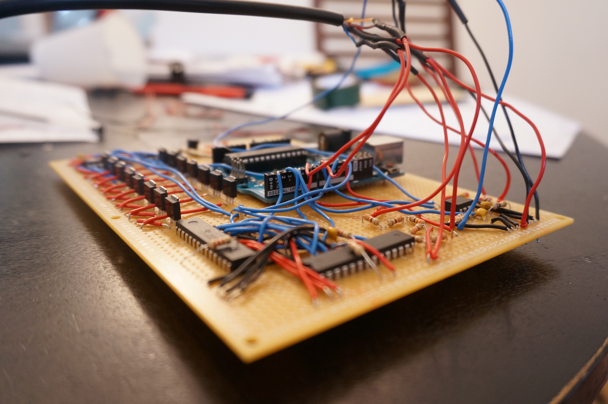
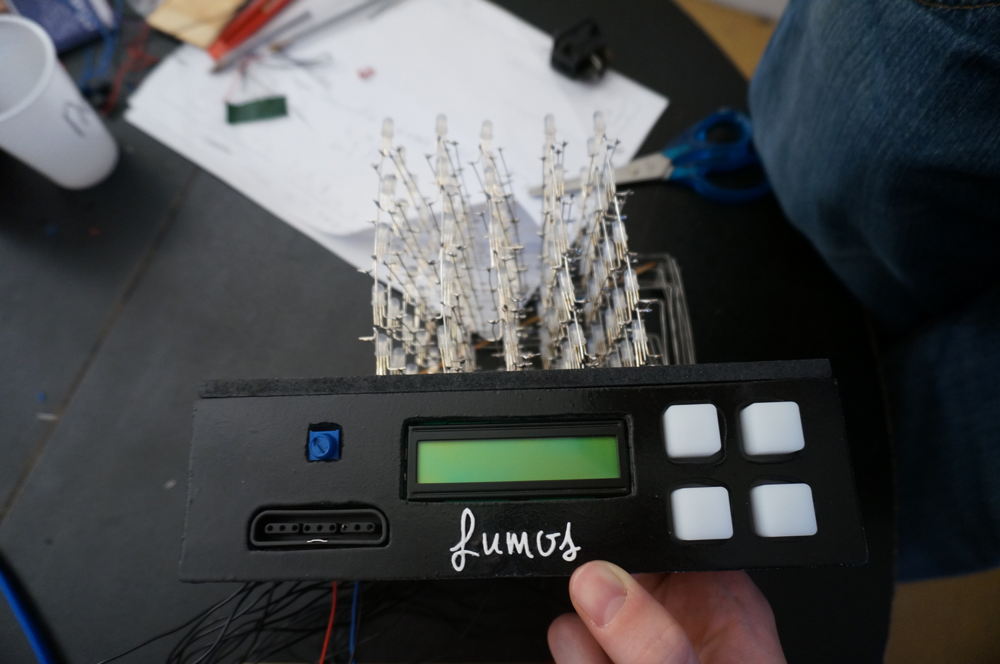

LED Cube - Software , Arduino Programming Language

Code controlling hardware LED Cube built with RGB LEDs capable of displaying any color.
When running this code, the cube can perform numerous light effects, can analyze surrounding sounds (both in terms of amplitude and frequency) and create light effects matching the surrounding music.
Our cube is also equipped with a "game mode", which allows the user to connect a PlayStation controller and play the famous Snake game in 3D on the cube's LEDs.

<a href="http://lumoscube.magix.net/public/index.html">Website</a>

Credits:  Gabriel M.R. , Adrian C. , Arthur B. , Arthur M. , Alexandre T. , Alexandre E.
